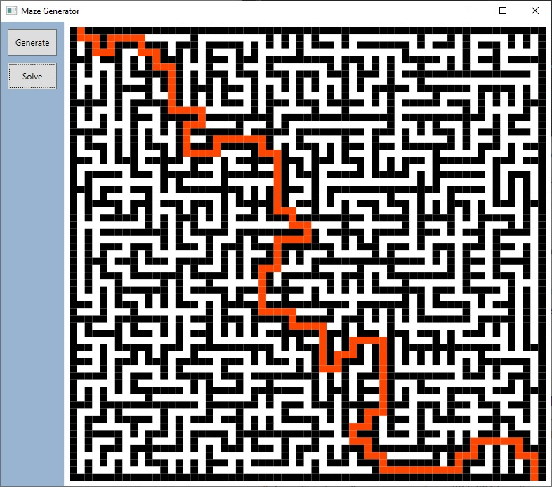

# Maze generator and solver written in C# #

This repo contains C# code for a maze generator and solver.  
Maze generation is performed using an implementation of Wilson's algorithm (see https://en.wikipedia.org/wiki/Maze_generation_algorithm#Wilson's_algorithm).  
Generated mazes are then solved using an A* pathfinding algorithm (see https://en.wikipedia.org/wiki/A*_search_algorithm).

 

The MazeGenerator solution consists of a single project:

- **MazeGenerator**: A WPF application that contains classes for the maze generator and solver, and implements a very simple UI to show the maze that has been generated and the path that has been found through the maze.

 

### Prerequisites

- [.NET 6](https://dotnet.microsoft.com/en-us/download)
  
  The MazeGenerator.sln file is a Visual Studio 2022 solution.

 

### Why was this created?

Just for fun. :-)  
  
 

### Usage

Simply run the **MazeGenerator** application. Click the **Generate** button to generate a random maze and then click the **Solve** button to find a path through the maze (from the entrance at the top left corner of the maze to the exit at the bottom right corner).  

The following screenshot shows the application in action (after a maze has been generated and solved).

 

### History

| Version | Details
|---:| ---
| 1.0.0 | Initial commit.
